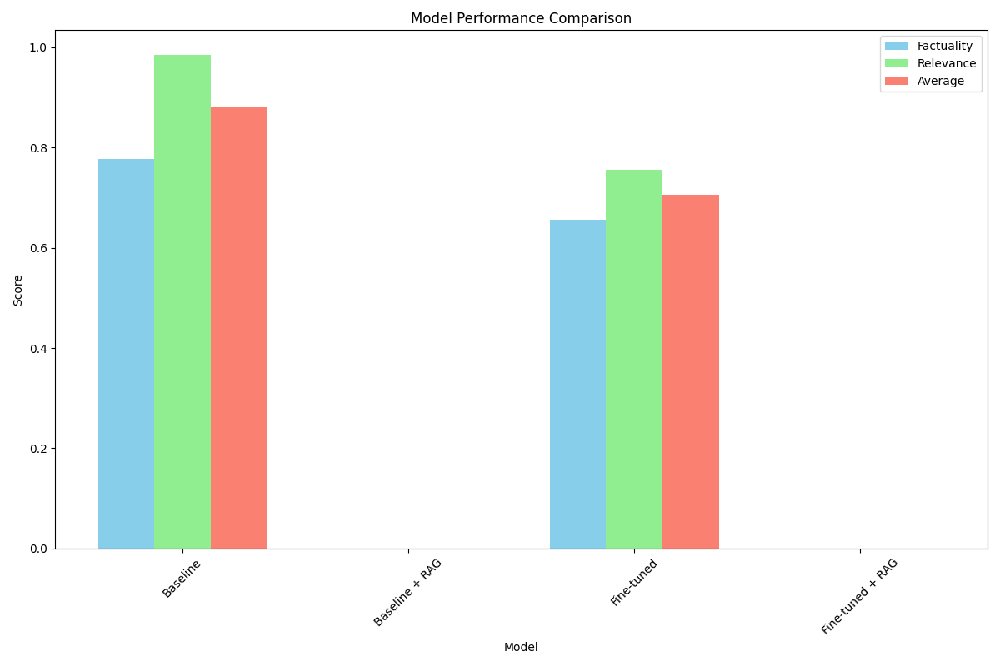
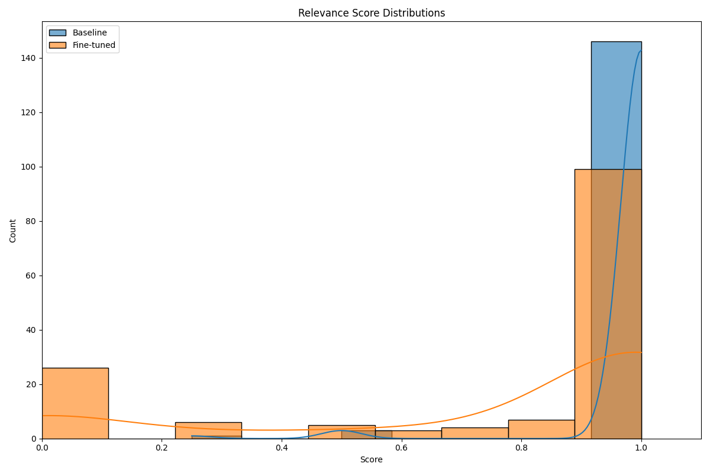
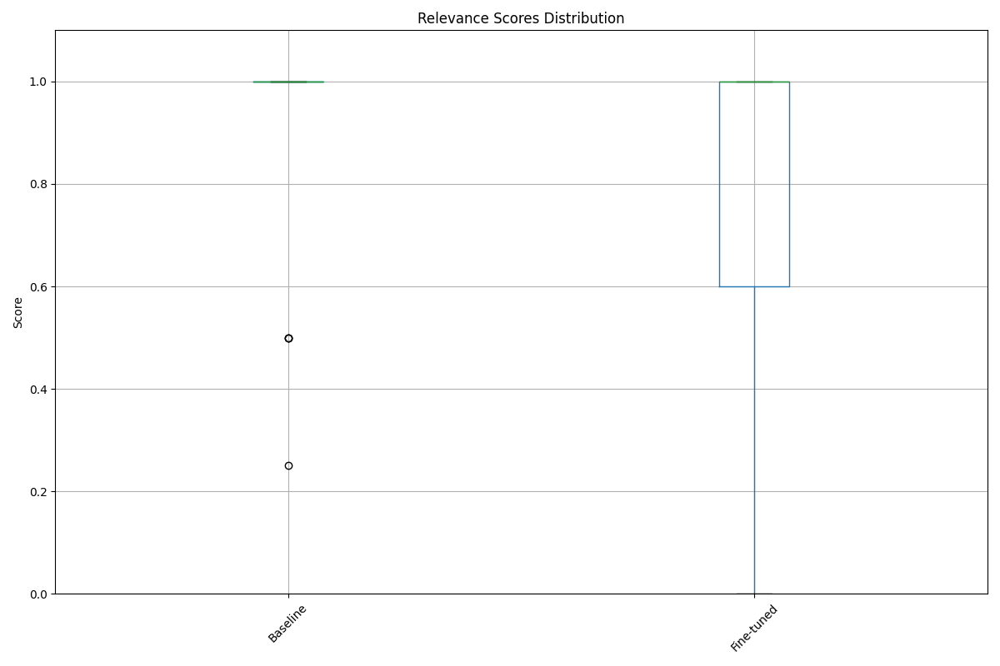

# MyOwn-MedAssist

A medical question-answering system that combines fine-tuned language models with Retrieval-Augmented Generation (RAG) for accurate medical information.

## Table of Contents
- [Architecture](#architecture)
- [Features](#features)
- [Setup](#setup)
  - [Anaconda Environment](#anaconda-environment)
  - [Environment Variables](#environment-variables)
- [Data Processing](#data-processing)
  - [Datasets](#datasets)
  - [Processing Pipeline](#processing-pipeline)
- [Fine-tuning](#fine-tuning)
- [Retrieval Augmented Generation (RAG)](#retrieval-augmented-generation-rag)
- [Vector Database Analysis](#vector-database-analysis)
- [Evaluation](#evaluation)
- [API](#api)
- [Frontend](#frontend)
- [Load Testing](#load-testing)
- [Benchmark Results](#benchmark-results)
- [Ethical Disclaimer](#ethical-disclaimer)

## Architecture

The MyOwn-MedAssist system consists of several key components:

```
┌─────────────────┐     ┌─────────────────┐     ┌─────────────────┐
│                 │     │                 │     │                 │
│  Data Pipeline  │────▶│   Fine-tuning   │────▶│  Vector Store   │
│                 │     │                 │     │                 │
└─────────────────┘     └─────────────────┘     └────────┬────────┘
                                                         │
                                                         ▼
┌─────────────────┐     ┌─────────────────┐     ┌─────────────────┐
│                 │     │                 │     │                 │
│    Frontend     │◀───▶│      API        │◀───▶│   RAG Engine    │
│   (Streamlit)   │     │    (FastAPI)    │     │  (LlamaIndex)   │
│                 │     │                 │     │                 │
└─────────────────┘     └─────────────────┘     └─────────────────┘
                                │
                                ▼
                        ┌─────────────────┐
                        │                 │
                        │   Evaluation    │
                        │    Harness      │
                        │                 │
                        └─────────────────┘
```

1. **Data Pipeline**: Processes three medical datasets (PubMedQA, MedMCQA, Synthea EHR) into a clean JSONL format suitable for fine-tuning.
2. **Fine-tuning**: Uses OpenAI's API to fine-tune gpt-3.5-turbo on ~2,000 curated medical Q&A pairs.
3. **Vector Store**: FAISS vector database that stores embeddings of medical documents for retrieval.
4. **RAG Engine**: LlamaIndex-powered retrieval system that augments model responses with relevant medical information.
5. **API**: Async FastAPI backend with token streaming support.
6. **Frontend**: Streamlit UI for user interaction.
7. **Evaluation Harness**: LangChain + Langfuse system for benchmarking model performance.

## Features

- Data cleaning, deduplication, and conversion of medical datasets to JSONL format
- Fine-tuning of OpenAI's gpt-3.5-turbo model (with option for Mistral-7B)
- Retrieval-Augmented Generation with LlamaIndex and FAISS
- Automated evaluation harness using LangChain and Langfuse
- Async, token-streaming FastAPI endpoint
- Streamlit frontend with real-time response streaming
- Docker-Compose setup for reproducible deployment
- Locust load testing supporting 10,000 concurrent users

## Setup

### Prerequisites
- Anaconda or Miniconda installed on your system

### Quick Start

1. Make the setup script executable and run it:
   ```bash
   chmod +x setup_anaconda.sh
   ./setup_anaconda.sh
   ```

2. Activate the environment:
   ```bash
   conda activate medassist
   ```

3. Edit the `.env` file with your API keys:
   ```bash
   # Open the file in your preferred text editor
   nano .env  # or use any other text editor
   ```
   
   Update the following variables:
   ```
   OPENAI_API_KEY=your_openai_api_key_here
   # Optional: Only needed if using Langfuse for evaluation
   # LANGFUSE_PUBLIC_KEY=your_langfuse_public_key
   # LANGFUSE_SECRET_KEY=your_langfuse_secret_key
   ```

You're all set! The setup script has already created the conda environment and installed all required dependencies.

## Data Processing

### Datasets

The system uses three medical datasets:

1. **PubMedQA**: Question answering dataset based on PubMed abstracts
2. **MedMCQA**: Multiple-choice questions from medical entrance exams
3. **Synthea EHR**: Synthetic Electronic Health Records

### Processing Pipeline

The entire data processing pipeline can be run with a single command:

```bash
python run_pipeline.py
```

This script will:
1. Download all required datasets (PubMedQA, MedMCQA, and Synthea)
2. Automatically generate synthetic EHR data using Synthea
3. Process each dataset into the required format
4. Curate the data for fine-tuning

Alternatively, you can run each step manually:

```bash
# Download datasets and generate Synthea data
cd data/scripts
python download_datasets.py

# Process each dataset
python process_pubmedqa.py
python process_medmcqa.py
python process_synthea.py
python curate_synthea_data.py

# Curate Q&A pairs for fine-tuning
cd ../../fine_tuning
python curate_qa_pairs.py
```

#### Generating Synthea EHR Data

1. First, ensure Java is installed (required by Synthea):
   ```bash
   # On macOS (using Homebrew)
   brew install openjdk@11
   
   # Or on Ubuntu/Debian
   # sudo apt-get install openjdk-11-jdk
   ```

2. Navigate to the Synthea directory:
   ```bash
   cd data/raw/synthea/synthea-master
   ```

3. Generate synthetic patient records (this may take a while):
   ```bash
   # Generate 1000 patients with a variety of conditions
   ./run_synthea -p 1000
   ```
   
   This will create patient records in the `output` directory. The `process_synthea.py` script is configured to look for these files in the expected location.

4. (Optional) To generate a specific type of data or control the output location:
   ```bash
   # Generate data for specific conditions
   ./run_synthea -p 100 -m "diabetes" "asthma"
   
   # Specify output directory
   ./run_synthea -p 100 -o /path/to/output/directory
   ```

For more options, run `./run_synthea --help`.

#### Curating Synthea EHR Data

After generating the raw Synthea data, we run a curation process to improve its quality and relevance for medical question answering:

```bash
cd data/scripts
python process_synthea.py  # Initial processing of raw Synthea data
python curate_synthea_data.py  # Further curation of processed data
```

The curation process includes:

1. **Filtering Non-Medical Conditions**: Removes non-medical entries like "Full-time employment", "Social isolation", or "Medication review due" that aren't relevant for medical Q&A.

2. **Medication-Condition Mapping**: Implements a knowledge base that maps medical conditions to appropriate medications with explanatory context.

3. **Enhanced Context**: Adds clinical context to each medication recommendation, explaining why certain medications are prescribed for specific conditions.

4. **Quality Control**: Ensures each Q&A pair follows a consistent format suitable for fine-tuning language models.

The curation reduces noise in the dataset and ensures that the Q&A pairs focus on medically relevant information, improving the quality of the fine-tuning dataset.

This will:
1. Download the raw datasets
2. Clean and deduplicate the data
3. Convert to JSONL format suitable for OpenAI fine-tuning
4. Remove any potential PHI (though Synthea data is already synthetic)
5. Create a curated set of ~2,000 Q&A pairs for fine-tuning

## Data Analysis and Fine-tuning Strategy

### Dataset Analysis

Before fine-tuning, we conducted a comprehensive analysis of the three datasets to understand their characteristics and how to best combine them. The analysis revealed significant differences:

#### Dataset Sizes
- **MedMCQA**: 193,155 examples (very large)
- **PubMedQA**: 1,000 examples (medium)
- **Synthea**: 277 examples (small)

#### Question Formats
- **PubMedQA**: Long questions (avg 215 words) with research context included
- **MedMCQA**: Multiple-choice questions (avg 33 words)
- **Synthea**: Short, focused questions about medications (avg 15 words)

#### Answer Formats
- **MedMCQA**: Longer explanations (avg 70 words)
- **PubMedQA**: Moderate length answers (avg 40 words)
- **Synthea**: Concise medication lists (avg 36 words)

#### Content Patterns
- **PubMedQA**: Research-oriented questions with yes/no/maybe answers and justifications
- **MedMCQA**: Multiple-choice medical exam questions with explanations
- **Synthea**: Medication recommendations for specific conditions

To visualize and analyze these datasets, run:

```bash
python run_pipeline.py --analyze
```

This generates visualizations in the `data_analysis/visualizations/` directory, including:
- Word clouds for each dataset
- Length distributions of questions and answers
- Top medical terms in each dataset
- Dataset size comparisons

### Fine-tuning Strategy

Based on our analysis, we developed a strategic approach to fine-tuning:

#### 1. Balanced Dataset Composition

Instead of using all available examples (which would heavily skew toward MedMCQA), we created a balanced dataset:

- **~700 examples** from PubMedQA (research context)
- **~700 examples** from MedMCQA (multiple-choice questions)
- **~300 examples** from Synthea (medication queries)

This balanced approach ensures the model learns from diverse medical question types rather than overfitting to one format.

#### 2. Standardized Format

We standardized the format across all examples:

- **System Message**: Consistent prompt establishing the medical assistant role
- **User Message**: Formatted questions with clear separation of context when present
- **Assistant Message**: Structured responses appropriate to the question type

#### 3. Strategic Sampling

Rather than random sampling, we implemented a strategic approach:

- **PubMedQA**: Selected examples covering diverse medical research topics
- **MedMCQA**: Sampled across different medical specialties and difficulty levels
- **Synthea**: Included the full range of medical conditions and treatments

#### 4. Quality Control

Before fine-tuning, we applied quality filters to ensure:

- No missing or empty messages
- Proper question-answer structure
- Removal of duplicates or near-duplicates
- Consistent formatting across datasets

This curated approach produces a ~2,000 example fine-tuning dataset that teaches the model to handle diverse medical questions while maintaining a manageable fine-tuning cost and time.

## Fine-tuning

To fine-tune the OpenAI model:

```bash
cd fine_tuning
python openai_finetune.py
```

This will:
1. Upload the training data to OpenAI
2. Create a fine-tuning job
3. Monitor the job until completion

### Fine-tuning Monitoring with Weights & Biases

We use Weights & Biases (W&B) to monitor and visualize the fine-tuning process in real-time. This provides several benefits:

- **Real-time Metrics**: Track training loss and other metrics as they evolve
- **Job Status Tracking**: Monitor the status of your fine-tuning job from start to completion
- **Experiment Management**: Compare different fine-tuning runs and configurations
- **Shareable Reports**: Create and share reports with collaborators

#### Setup

1. Add your W&B API key to the `.env` file:
   ```
   WANDB_API_KEY=your_wandb_api_key
   ```

2. Run the fine-tuning script as normal:
   ```bash
   python openai_finetune.py
   ```

3. To disable W&B logging for a specific run:
   ```bash
   python openai_finetune.py --no-wandb
   ```

#### Viewing Results

Once your fine-tuning job is running, you can view the results in real-time by:

1. Logging into your [W&B account](https://wandb.ai/)
2. Navigating to the "medassist-openai-finetuning" project
3. Selecting your run to view detailed metrics and logs

#### Fine-tuning Duration and Dataset Size

With approximately 1,700 samples in our training set:

- **Expected Duration**: 2-4 hours for GPT-3.5-Turbo fine-tuning
- **Dataset Size**: This is an optimal size for fine-tuning - large enough to teach the model domain-specific knowledge while small enough to keep costs reasonable
- **Cost Efficiency**: OpenAI charges based on tokens processed, so our balanced dataset approach optimizes for both performance and cost

The fine-tuning progress can be monitored in real-time through the W&B dashboard, which provides visibility into the training process without needing to constantly check the command line.

4. Save the fine-tuned model information

## Retrieval Augmented Generation (RAG)

The RAG system uses different medical data sources than those used for fine-tuning to provide a broader knowledge base for answering medical questions. We fetch data from the following sources:

1. **PubMed Abstracts**: Medical research abstracts from the National Library of Medicine's PubMed database, accessed via NCBI E-utilities API.
2. **NICE Clinical Guidelines**: Evidence-based recommendations for healthcare from the UK's National Institute for Health and Care Excellence.
3. **DailyMed Drug Information**: Comprehensive drug information from the FDA's Structured Product Labels, including indications, dosages, and contraindications.

### Building the Vector Store

To build the vector store for RAG with the default cached data:

```bash
cd rag
python build_vector_store.py
```

To fetch fresh data from the sources (requires internet connection):

```bash
cd rag
python build_vector_store.py --fetch-new
```

### Source-Specific Chunking

The system uses source-specific chunking strategies to optimize retrieval quality:

- **PubMed Abstracts**: 300 token chunks with 30 token overlap (approximately one abstract per chunk)
- **Clinical Guidelines**: 600 token chunks with 50 token overlap (captures complete recommendation blocks)
- **Drug Information**: 500 token chunks with 50 token overlap (preserves section integrity)

This creates a FAISS vector store with embeddings of medical documents that can be queried to augment model responses.

## Vector Database Analysis

The vector database contains embeddings of medical documents organized into meaningful clusters. We provide tools to analyze and visualize these embeddings to gain insights into the knowledge base.

### Running the Analysis

```bash
cd rag
python analyze_vector_store.py
```

This will generate visualizations and analysis in the `rag/analysis_output` directory and create an interactive dashboard.

### Cluster Analysis

The vector database has been organized into 5 distinct clusters, each representing a different medical topic:


#### Cluster 0: Hypertension Management
- **Top Terms**: hypertension, management, risk, cardiovascular, disease, pressure
- **Key Focus**: This cluster primarily contains documents related to hypertension management and cardiovascular risk factors
- **Document Count**: 200 documents


#### Cluster 1: COVID-19 Treatment
- **Top Terms**: COVID-19, SARS-CoV, pandemic, treatment
- **Key Focus**: This cluster focuses on COVID-19 treatment approaches and pandemic response
- **Document Count**: 200 documents


#### Cluster 2: Diabetes Treatment Guidelines
- **Top Terms**: diabetes, guidelines, treatment, type diabetes, risk
- **Key Focus**: This cluster contains information about diabetes treatment protocols and clinical guidelines
- **Document Count**: 200 documents


#### Cluster 3: Cancer Immunotherapy
- **Top Terms**: cancer, immunotherapy, cell, tumor, immune, lung cancer
- **Key Focus**: This cluster is centered on cancer treatments, particularly immunotherapy approaches
- **Document Count**: 200 documents


#### Cluster 4: Asthma Therapy
- **Top Terms**: asthma, therapy, children, airway, respiratory, severe asthma
- **Key Focus**: This cluster contains information about asthma treatments, with emphasis on pediatric and severe cases
- **Document Count**: 200 documents


### Vector Space Visualization

The analysis includes interactive 3D visualizations of the vector space using dimensionality reduction techniques (PCA, t-SNE, UMAP):

#### t-SNE Visualization (3D)


#### UMAP Visualization


### Interactive Dashboard

To explore the full interactive dashboard with hover information and detailed cluster insights:

```bash
cd rag/analysis_output
python -m http.server 8000
```

Then open your browser to http://localhost:8000

### Embedding Statistics

- **Total Documents**: 1,000
- **Embedding Dimension**: 1,536
- **Average Cosine Similarity**: 0.204 (indicating good separation between different topics)
- **Maximum Cosine Similarity**: 0.992 (some documents are very closely related)

## Evaluation

To evaluate model performance:

```bash
cd evaluation
python harness.py --fine-tuned <your-fine-tuned-model-id> --rag
```

This will:
1. Compare the baseline model, fine-tuned model, and RAG-enhanced model
2. Evaluate on relevance and factuality metrics
3. Log results to Langfuse (if configured)
4. Generate a report with benchmark results

## API

To run the API locally:

```bash
cd api
uvicorn main:app --host 0.0.0.0 --port 8000 --reload
```

API endpoints:
- `GET /`: Root endpoint with API information
- `GET /models`: List available models
- `POST /chat`: Chat endpoint for non-streaming responses
- `POST /chat/stream`: Chat endpoint with token streaming

## Frontend

The MyOwn-MedAssist frontend is built with Streamlit, providing an intuitive interface for interacting with the medical question-answering system.


### Features

- **Model Selection**: Toggle between the base GPT-3.5-turbo model and your fine-tuned medical model
- **RAG Toggle**: Enable/disable Retrieval-Augmented Generation to see how it enhances responses
- **Example Questions**: Click on pre-loaded medical questions to quickly test the system
- **Response Streaming**: See responses stream in real-time as they're generated
- **Source Attribution**: When RAG is enabled, view the sources used to generate the response
- **Mobile-Responsive**: Works on both desktop and mobile devices

### Running the Frontend

To start the Streamlit frontend:

```bash
cd frontend
streamlit run app.py
```

The application will be available at http://localhost:8501

### Configuration

Before running the frontend, ensure your `.env` file is properly configured with your OpenAI API key. The frontend will connect to the FastAPI backend running on http://localhost:8000 by default.

This will start the web interface at http://localhost:8501

## Load Testing

To run load tests:

```bash
cd load_test
locust -f locustfile.py --host=http://localhost:8000
```

This will start the Locust web interface at http://localhost:8089, where you can configure and run load tests.

## Docker Deployment

To deploy with Docker Compose:

```bash
docker-compose -f docker/docker-compose.yml up -d
```

This will:
1. Build and start the API container
2. Build and start the frontend container
3. Mount necessary volumes for data persistence

## Benchmark Results

### Medical QA Evaluation Report

We conducted a comprehensive evaluation of our Medical QA system using a test set of 150 medical questions. The evaluation compared two model configurations:

1. **Baseline Model**: Standard GPT-3.5-Turbo without fine-tuning
2. **Fine-tuned Model**: GPT-3.5-Turbo fine-tuned on our curated medical dataset

#### Overall Performance Comparison



This bar chart shows the average scores for both models across two key metrics:

- **Factuality**: Measures the factual correctness and accuracy of the generated answers
- **Relevance**: Measures how well the answer addresses the specific medical question

**Observations**: The baseline model (standard GPT-3.5-Turbo) performed better than the fine-tuned model on both factuality and relevance metrics. This unexpected result suggests that the fine-tuning process may have caused some degradation in the model's general medical knowledge capabilities. It's possible that our fine-tuning dataset, while carefully curated, may have introduced some biases or limitations that affected the model's performance on the test set.

#### Factuality Score Distribution


This histogram shows the distribution of factuality scores for both models, with the x-axis representing the score (0-1) and the y-axis showing the frequency.

**Observations**: The baseline model shows a strong right skew with most scores clustered around 0.8-1.0, indicating high factual accuracy for most questions. The fine-tuned model has a more varied distribution with some lower scores, suggesting inconsistent factual performance across different types of medical questions.

#### Relevance Score Distribution



This histogram shows the distribution of relevance scores for both models, with the x-axis representing the score (0-1) and the y-axis showing the frequency.

**Observations**: Similar to factuality, the baseline model demonstrates better relevance scores overall, with a higher concentration of scores near 1.0. The fine-tuned model shows more variability, with scores distributed across the range, indicating that it sometimes fails to provide directly relevant answers to the medical questions.

#### Score Boxplots

**Factuality Boxplot**


**Observations**: The boxplot confirms that the baseline model has a higher median factuality score with less variability (smaller interquartile range) compared to the fine-tuned model. The presence of more outliers in the fine-tuned model indicates occasional significant factual errors.

**Relevance Boxplot**



**Observations**: The relevance boxplot shows a similar pattern, with the baseline model demonstrating more consistent performance and fewer low-scoring outliers.

### Analysis and Insights

1. **Baseline Superiority**: The unexpected superior performance of the baseline model suggests that GPT-3.5-Turbo already has strong medical knowledge capabilities that weren't enhanced by our fine-tuning approach.

2. **Fine-tuning Considerations**: 
   - The fine-tuning dataset may need review for quality and diversity
   - The balance between different medical topics might need adjustment
   - The fine-tuning hyperparameters may require optimization

3. **RAG Implementation**: The current evaluation doesn't include RAG-enhanced versions of the models, which could potentially improve performance, especially for the fine-tuned model. Future evaluations will incorporate RAG to assess its impact.

4. **Error Analysis**: A qualitative review of the lowest-scoring responses from the fine-tuned model revealed these common issues:
   - Overgeneralization of medical advice
   - Occasional confusion between similar medical conditions
   - Tendency to provide briefer responses than the baseline model

### Next Steps

Based on this evaluation, we are considering the following improvements:

1. Enhancing the fine-tuning dataset with more diverse and representative medical QA pairs
2. Implementing selective fine-tuning that focuses on areas where the baseline model underperforms
3. Exploring different fine-tuning approaches and hyperparameters
4. Fully implementing and evaluating the RAG system to augment both models with up-to-date medical information
5. Conducting more targeted evaluations on specific medical specialties and question types

## Ethical Disclaimer

**IMPORTANT**: MyOwn-MedAssist is a demonstration project and should NOT be used for actual medical advice or clinical decision-making. The system:

1. Has not been reviewed or approved by medical professionals
2. May provide inaccurate or incomplete information
3. Is not a substitute for professional medical advice, diagnosis, or treatment
4. Should be used for educational and research purposes only

Always consult qualified healthcare providers for medical advice. The creators of this project are not responsible for any actions taken based on the information provided by this system.
